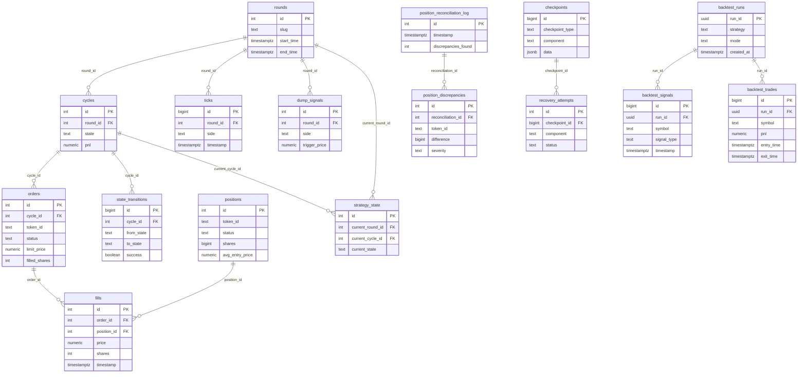
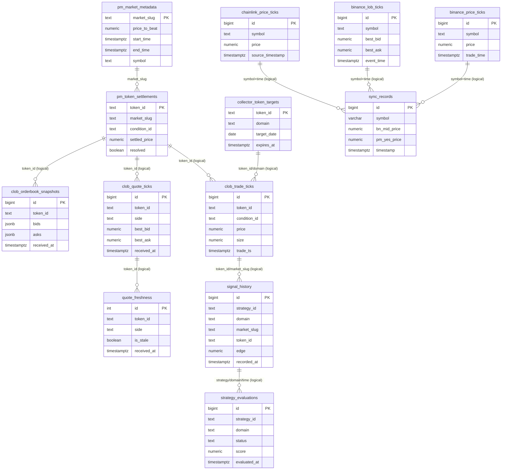

# tango-1-1 Mermaid ERD

- Generated at: 2026-03-02T05:23:07Z
- Source DB: `tango-1-1` / `ploy`
- Note: Diagram A uses enforced FK only. Diagram B adds logical (application-level) links.

## Diagram A: Enforced FK ERD (Ground Truth)

## Diagram B: Market Data + Research (Logical Links)

## Quick Read

- Trading execution chain (strict FK): `rounds -> cycles -> orders -> fills -> positions`
- Backtest chain (strict FK): `backtest_runs -> backtest_signals/backtest_trades`
- Most large-volume tables are market data tables (`clob_*`, `binance_*`, `sync_records`) and are linked mostly by logical keys (`token_id`, `symbol`, `market_slug`) rather than FK constraints.
